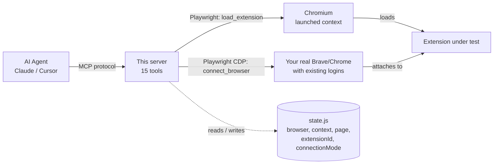

# Chrome Extension Tester — MCP Server

An **MCP (Model Context Protocol) server** that lets Claude interactively test any unpacked Chrome extension using Playwright. Load your extension, interact with its popup and options page, inspect storage, monitor network requests, check badges, test messaging, and more — all through natural language.

---

## Table of Contents

- [Why](#why)
- [Architecture](#architecture)
- [Features](#features)
- [Requirements](#requirements)
- [Installation](#installation)
- [Setup with Claude Desktop](#setup-with-claude-desktop)
- [Setup with Claude Code (npx)](#setup-with-claude-code-npx)
- [Available Tools](#available-tools)
- [Testing Agent Prompt](#testing-agent-prompt)
- [Example: testing an extension popup](#example-testing-an-extension-popup)
- [Example: testing against your real browser](#example-testing-against-your-real-browser)
- [Example Prompts](#example-prompts)
- [Project Structure](#project-structure)
- [Notes](#notes)

---

## Why

Testing a Chrome extension during development means manually clicking reload, opening the popup, checking storage in DevTools, watching the service worker console, and copy-pasting errors back to the agent on every iteration. This MCP server gives an AI coding agent direct access to all of that through tool calls, so the agent can iterate on its own. It exists because the manual loop made working with Claude Code on extensions too slow.

---

## Architecture



Two connection modes:
- **Launched** — `load_extension` spins up a fresh Chromium with only your extension installed. Clean, isolated, no side effects.
- **CDP** — `connect_browser` attaches to your running Brave or Chrome via the Chrome DevTools Protocol. All your existing logins and tabs are preserved, so you can test against real authenticated sessions.

---

## Features

- **Connect to your real Brave or Chrome** with all existing logins intact — test against authenticated sessions without re-logging in
- **List installed extensions by name** and target any one by name or ID; throws on ambiguous matches instead of silently picking the wrong extension
- Load and reload any unpacked Chrome extension in an isolated Chromium instance
- Interact with popup and options pages (click, type, read content)
- Inspect and manipulate `chrome.storage` (local / sync / session) — always targets the correct extension's service worker, never a neighbouring extension's
- Read background service worker logs — filtered to your target extension only
- Monitor and inspect network requests
- Check and assert badge text and color
- Send messages to the background script and validate responses
- Enumerate, open, close, and switch browser tabs — works in both launched and real-browser (CDP) mode
- Test context menu registration and handler invocation
- Run assertions that return structured PASS / FAIL results
- Take screenshots at any point during testing
- Create and reuse test accounts on any website using disposable email (via Guerrilla Mail API)

---

## Requirements

- **Node.js** 18 or higher
- **Claude Desktop** or **Claude Code** with MCP support
- A Chrome extension with a `manifest.json` (Manifest V2 or V3)

---

## Installation

### Option A — npx (no install needed)

```bash
npx chrome-extension-tester-mcp
```

### Option B — install globally

```bash
npm install -g chrome-extension-tester-mcp
```

### Option C — clone and run locally

```bash
git clone https://github.com/BHUVAN-RJ/chrome-extension-testing-mcp.git
cd chrome-extension-testing-mcp
npm install
npx playwright install chromium
```

---

## Setup with Claude Desktop

Add the following to your Claude Desktop MCP config file:

**macOS / Linux** — `~/.config/claude/claude_desktop_config.json`
**Windows** — `%APPDATA%\Claude\claude_desktop_config.json`

### Using npx (recommended)

```json
{
  "mcpServers": {
    "chrome-extension-tester": {
      "command": "npx",
      "args": ["chrome-extension-tester-mcp"]
    }
  }
}
```

### Using a local clone

```json
{
  "mcpServers": {
    "chrome-extension-tester": {
      "command": "node",
      "args": ["/absolute/path/to/chrome-extension-testing-mcp/src/index.js"]
    }
  }
}
```

Restart Claude Desktop after saving the config.

---

## Setup with Claude Code (npx)

Add to your project's `.mcp.json` or user-level MCP config:

```json
{
  "mcpServers": {
    "chrome-extension-tester": {
      "command": "npx",
      "args": ["chrome-extension-tester-mcp"]
    }
  }
}
```

---

## Available Tools

| Tool | What it does |
|------|-------------|
| `connect_browser` | Attach to your real Brave/Chrome (preserving logins), list installed extensions, or scan for debuggable browsers |
| `load_extension` | Launch an isolated Chromium with an unpacked extension; captures the extension ID automatically |
| `interact_with_popup` | Open the popup, then click elements, type text, or read content |
| `open_options_page` | Open the extension's options / settings page and interact with it |
| `inspect_dom` | Navigate to a URL, query a DOM selector, or evaluate arbitrary JavaScript |
| `get_service_worker_logs` | Read buffered console logs from the target extension's service worker; optionally clear them |
| `take_screenshot` | Save a screenshot of the current page or popup |
| `run_assertion` | Assert that an element exists, has specific text, or a JS expression is truthy — returns PASS or FAIL |
| `extension_storage` | Get, set, remove, or clear keys in `chrome.storage.local`, `.sync`, or `.session` |
| `monitor_network` | Capture network requests during navigation; retrieve or clear the captured list |
| `check_badge` | Read or assert the extension action badge text and background color |
| `send_message_to_background` | Send `chrome.runtime.sendMessage` from the popup context and return the response |
| `test_context_menu` | Check `contextMenus` API availability, simulate right-click, or invoke a menu item handler directly |
| `simulate_tab_events` | Open, close, switch, list, or close all browser tabs — works in both launched and CDP mode |
| `test_account_login` | Create or reuse a test account on any website using a disposable email; credentials are stored in `test-accounts.json` and reused across sessions |

### `connect_browser`
Attach to your real Brave or Chrome browser, preserving all existing logins and open tabs.

**Inputs:**
- `action` (string, required): `scan` | `connect` | `launch` | `list_extensions`
- `port` (number, default `9222`) — CDP debug port, for `connect`
- `browser_name` (string, default `"Brave"`) — which browser to launch, for `launch`
- `debug_port` (number, default `9222`) — debug port to use when launching, for `launch`
- `extension_id` (string) — 32-char extension ID **or a name substring** (e.g. `"MyExt"`) to target for `connect` / `launch`. Throws if the name matches more than one installed extension — use the full ID in that case.
- `browser_name_for_extensions` (string, default `"Brave"`) — which browser's extension directory to scan, for `list_extensions`

**Actions:**
| Action | What it does |
|--------|-------------|
| `scan` | List all browsers currently running with remote debugging enabled, plus all installed browsers |
| `connect` | Attach to a browser already running with `--remote-debugging-port` |
| `launch` | Start an installed browser with your real profile and remote debugging, then connect |
| `list_extensions` | List all installed extensions with their IDs and names |

**Returns:** Connection confirmation with the resolved extension ID, or the list of extensions/browsers.

> **Note:** To use `connect`, your browser must be started with `--remote-debugging-port=9222`. Use `launch` to have the server start it for you. Only one Chrome-based browser instance can run per profile — close your existing window before using `launch`.

### `load_extension`
Launch an isolated Chromium with an unpacked extension and capture its ID.
**Inputs:** `extension_path` (string, required) — path to the unpacked extension folder.
**Returns:** Text confirming the resolved path and the detected extension ID.

### `interact_with_popup`
Open the popup and click, type, or read its DOM.
**Inputs:** `action` (string, required: `open` | `click` | `type` | `get_text` | `get_html`); `selector` (string); `value` (string, for `type`).
**Returns:** Text describing the action result, or the requested text/HTML.

### `open_options_page`
Open the options page (or any extension page) and interact with it.
**Inputs:** `page` (string, default `options.html`); `action` (string: `open` | `click` | `type` | `get_text` | `get_html`); `selector` (string); `value` (string).
**Returns:** Text describing the action result, or the requested text/HTML.

### `inspect_dom`
Query a selector or evaluate JS in a page, optionally navigating first.
**Inputs:** `url` (string); `selector` (string); `script` (string, overrides `selector`).
**Returns:** Text with matched elements' outerHTML, or the JSON-serialized script result.

> In CDP mode, if the active page is a restricted URL (`devtools://`, `chrome://`, `chrome-extension://`), a fresh tab is opened automatically rather than failing.

### `get_service_worker_logs`
Read buffered console logs from the target extension's background service worker.
**Inputs:** `clear_after` (boolean, default `false`).
**Returns:** Text listing captured log entries, or a "none captured yet" message.

> Logs are filtered to the extension set via `extension_id` in `connect_browser`. In a real browser with many extensions installed, only logs from your target extension are captured — not those from other extensions like Grammarly or password managers.

### `take_screenshot`
Save a screenshot of the current page or popup.
**Inputs:** `output_path` (string, default `./screenshot.png`); `full_page` (boolean, default `false`).
**Returns:** Text with the saved file path.

### `run_assertion`
Assert an element exists/has text, or that a JS expression is truthy.
**Inputs:** `description` (string, required); `selector` (string); `expected_text` (string); `script` (string, overrides `selector`).
**Returns:** Text beginning with `PASS` or `FAIL`, followed by detail.

### `extension_storage`
Read from or write to `chrome.storage` (local / sync / session).
**Inputs:** `action` (string, required: `get` | `set` | `remove` | `clear`); `area` (string, default `local`); `keys` (string[]); `data` (object, for `set`).
**Returns:** Text with storage contents, or a confirmation of the write/removal.

> Operates via the target extension's service worker. If no service worker is found for the targeted extension ID, throws a descriptive error listing all active workers so you can retarget with `connect_browser`.

### `monitor_network`
Capture and inspect network requests during navigation.
**Inputs:** `action` (string, required: `navigate_and_capture` | `get_captured` | `clear`); `url` (string); `filter_pattern` (string); `include_types` (string[]).
**Returns:** Text listing captured requests as `[method] [type] status url`.

### `check_badge`
Read or assert the action badge text and background color.
**Inputs:** `action` (string, required: `get` | `assert_text` | `assert_color`); `tab_id` (number); `expected_text` (string); `expected_color` (number[] RGBA).
**Returns:** Text with the badge value, or a `PASS` / `FAIL` assertion result.

### `send_message_to_background`
Send `chrome.runtime.sendMessage` from the popup and return the response.
**Inputs:** `message` (object, required); `timeout_ms` (number, default `5000`).
**Returns:** Text with the sent message and JSON response, or a failure message.

### `test_context_menu`
Check the `contextMenus` API, simulate a right-click, or trigger an item.
**Inputs:** `action` (string, required: `check_api` | `right_click` | `trigger_item`); `url` (string); `selector` (string); `menu_item_id` (string); `page_url` (string).
**Returns:** Text with API availability, dispatch confirmation, or trigger result.

### `simulate_tab_events`
Open, close, switch, list, or close all browser tabs.
**Inputs:** `action` (string, required: `open` | `close` | `switch` | `list` | `close_all`); `url` (string); `tab_index` (number).
**Returns:** Text describing the affected tab(s), or the list of open tabs.

> Works in both launched Chromium and CDP (real browser) mode. In CDP mode, lists and controls all tabs in your real browser, including ones opened by extension automation.

### `test_account_login`
Create or reuse a test account on a site using a disposable email.
**Inputs:** `action` (string, required: `auto` | `create` | `login`); `account_key` (string, required); `signup_url` / `login_url` (string); selector overrides (`email_selector`, `password_selector`, `submit_selector`, `pre_click_selector`); multi-step fields (`step2_url`, `step2_password_selector`, `step2_submit_selector`).
**Returns:** Text reporting account creation/login status plus a screenshot path.

---

## Testing Agent Prompt

The server includes a built-in MCP prompt called **`extension-tester-agent`** — a fully automated testing agent that validates all implemented changes and returns a structured report.

### Arguments

| Argument | Required | Description |
|----------|----------|-------------|
| `extension_path` | yes | Absolute path to the unpacked extension folder |
| `extension_description` | yes | What the extension does — features, UI, storage, background behaviour |
| `changes` | yes | Everything implemented or changed in this session |

### What it does

1. **Understands** the extension and derives a set of tests from the changes list
2. **Writes a test plan** — every change maps to at least one test and the right MCP tool
3. **Executes every test** — never skips, takes screenshots on failure
4. **Reports** a structured PASS / FAIL table with details on any failures

### How to invoke

After implementing changes, tell Claude:

```
Use the extension-tester-agent prompt with:
- extension_path: /path/to/my-extension
- extension_description: "A tab manager that saves sessions to chrome.storage.local and restores them via a popup"
- changes: "Added save button; save button writes open tabs to storage.local; badge shows count of saved tabs"
```

Claude will write the test plan, execute every test, and return a full report.

---

## Example: testing an extension popup

A typical loop the agent can run on its own:

**1. Load the extension**

```json
{ "tool": "load_extension", "arguments": { "extension_path": "/tmp/my-extension" } }
```

```
Extension loaded.
Path: /tmp/my-extension
Extension ID: ddnjmkpjnchafihagpljebmkdpejhaoj
```

**2. Open the popup and read its HTML**

```json
{ "tool": "interact_with_popup", "arguments": { "action": "open" } }
```

```html
<body>
  <h1>Tab Saver</h1>
  <button id="save">Save open tabs</button>
  <span id="count">0 saved</span>
</body>
```

**3. Read local storage**

```json
{ "tool": "extension_storage", "arguments": { "action": "get", "area": "local" } }
```

```json
storage.local contents:
{
  "savedTabs": [],
  "enabled": true
}
```

---

## Example: testing against your real browser

Use this flow when your extension needs to interact with pages where you're already logged in (LinkedIn, Gmail, internal tools, etc.).

**1. Start Brave with remote debugging** (one-time setup)

```bash
/Applications/Brave\ Browser.app/Contents/MacOS/Brave\ Browser --remote-debugging-port=9222
```

Or just use `launch` to have the server handle it:

**2. Scan and connect**

```json
{ "tool": "connect_browser", "arguments": { "action": "scan" } }
```
```
Running browsers with remote debugging:
  Port 9222: Chrome/149.0.7827.54

Use action:"connect" with port:9222 to attach.
```

**3. List installed extensions and pick the right one**

```json
{ "tool": "connect_browser", "arguments": { "action": "list_extensions" } }
```
```
Installed extensions (5):
  eimadpbcbfnmbkopoojfekhnkhdbieeh  Dark Reader
  ghmbeldphafepmbegfdlkpapadhbakde  Proton Pass: Free Password Manager
  ikiaabefahnnfjninfhfeolbgkfnldpa  MyJobBot - Autofill
  ...

Pass the ID or name substring as extension_id when connecting.
```

**4. Connect targeting your extension by name**

```json
{ "tool": "connect_browser", "arguments": { "action": "connect", "port": 9222, "extension_id": "MyJobBot" } }
```
```
Connected to Chrome/149.0.7827.54 on port 9222.
Extension ID: ikiaabefahnnfjninfhfeolbgkfnldpa
Your existing tabs and logged-in sessions are preserved.
```

**5. List tabs, switch to one opened by the extension, inspect the DOM**

```json
{ "tool": "simulate_tab_events", "arguments": { "action": "list" } }
{ "tool": "simulate_tab_events", "arguments": { "action": "switch", "tab_index": 4 } }
{ "tool": "inspect_dom", "arguments": { "script": "document.querySelector('#apply-button')?.textContent" } }
```

---

## Example Prompts

```
Load my extension from /Users/me/my-extension and open the popup
```

```
Click the button with selector #save and take a screenshot
```

```
Navigate to https://example.com and check if my content script injected a .banner element
```

```
Read all keys from chrome.storage.local
```

```
Set { "enabled": true } in chrome.storage.local and verify it was saved
```

```
Navigate to https://example.com, capture all network requests, then show me any that were blocked
```

```
Check the badge text — it should say "ON"
```

```
Send the message { "type": "GET_STATUS" } to the background and show the response
```

```
Open a tab to https://news.ycombinator.com, then another to https://github.com, then list all open tabs
```

```
Connect to my real Brave browser and list all installed extensions
```

```
Connect to Brave targeting the "MyJobBot" extension and read its chrome.storage.local
```

```
List all open tabs in my Brave browser and switch to the LinkedIn one
```

```
Right-click on https://example.com and trigger the context menu item with id "my-action"
```

```
Create a test account on https://example.com/signup and save it as "my_test_account"
```

```
Log in to https://example.com/login using the stored "my_test_account" credentials
```

---

## Project Structure

```
chrome-extension-testing-mcp/
├── src/
│   ├── index.js              # MCP server entry point
│   ├── state.js              # Shared browser state and helpers (ensureBrowser, ensurePage, getServiceWorker)
│   ├── prompts/
│   │   ├── index.js          # Registers MCP prompts
│   │   └── extension-tester.js  # extension-tester-agent prompt definition
│   └── tools/
│       ├── index.js          # Aggregates all tool definitions and handlers
│       ├── connect-browser.js  # CDP connection to real Brave/Chrome; list_extensions; name-based targeting
│       ├── load-extension.js
│       ├── popup.js
│       ├── dom.js
│       ├── logs.js
│       ├── screenshot.js
│       ├── assertion.js
│       ├── storage.js
│       ├── network.js
│       ├── options-page.js
│       ├── context-menu.js
│       ├── badge.js
│       ├── messaging.js
│       ├── tabs.js
│       └── account-login.js
├── package.json
└── README.md
```

---

## Notes

- The browser launches in **headed mode** (visible window) so you can watch tests run in real time
- Screenshots default to `./screenshot.png` unless a custom path is provided
- Service worker logs are buffered from the moment the browser connects; in CDP mode they are filtered to the targeted extension only
- Call `load_extension` again at any time to get a fresh isolated browser instance
- Native Chrome context menus cannot be automated by Playwright — use `test_context_menu` with `trigger_item` to invoke handlers directly
- Badge and storage tools communicate via the service worker, so the extension must have a background service worker (MV3)
- `test_account_login` uses the [Guerrilla Mail API](https://www.guerrillamail.com/GuerrillaMailAPI.html) to generate disposable emails — no browser navigation required, no bot-blocking. Credentials are stored in `test-accounts.json` at the project root (add this to `.gitignore`)
- Use `action: "auto"` for `test_account_login` to automatically reuse stored credentials or create a new account if none exist
- In CDP mode (`connect_browser`), `inspect_dom` automatically avoids navigating restricted pages (`devtools://`, `chrome://`, `chrome-extension://`) by opening a new tab when needed
- Only one Chrome-based browser instance can run per profile — if `connect_browser launch` fails, close the existing browser window first
- `extension_id` in `connect_browser` accepts either a full 32-character ID or a name substring. If the substring matches multiple extensions, an error is thrown listing all matches so you can switch to the full ID

---

## License

MIT
